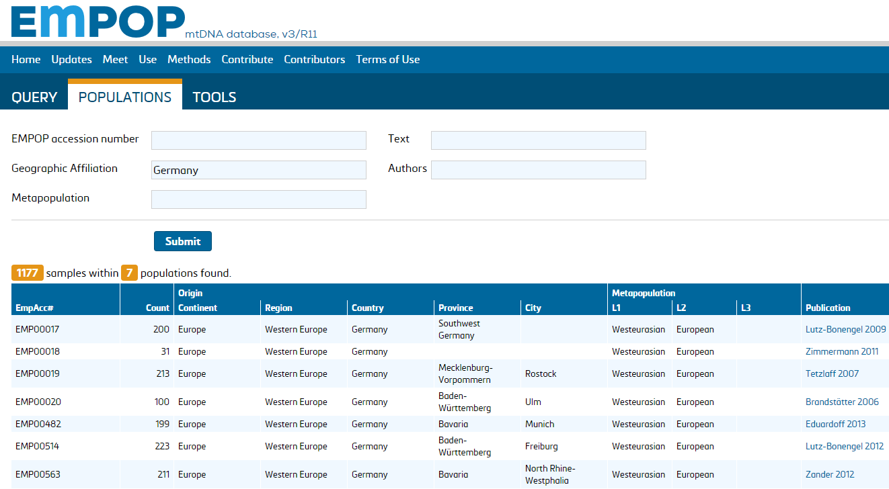

## 5. Browsing EMPOP for Populations

Under the tab POPULATIONS the individual datasets contained in EMPOP can be found by using the accession number (if known), geographic or metapopulation affiliations.
Published datasets can be searched by Text (Title) and Authors.
