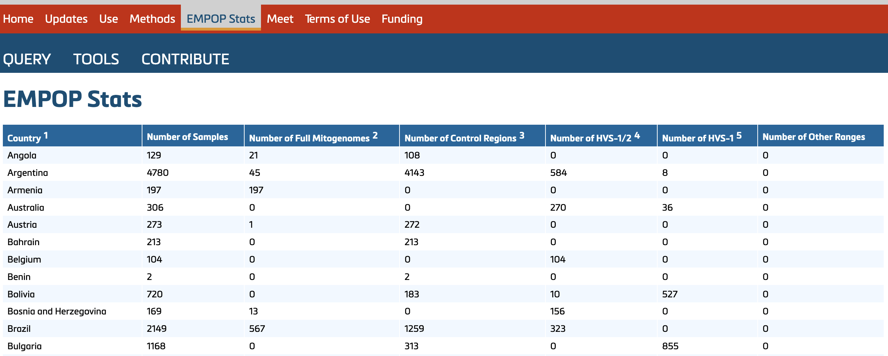

## 5. EMPOP populations

The EMPOP Stats tab displays a summary table that provides an overview of the individual datasets included in EMPOP. The table includes details such as:
- The number of samples in each dataset
- The sequenced range(s) covered by each dataset

