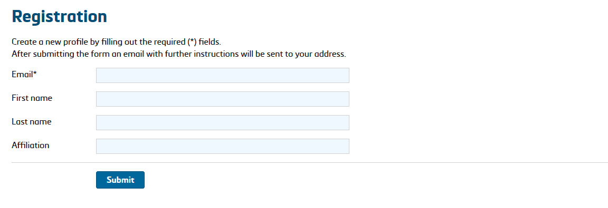

## 3. Register & Login
An EMPOP user is identified by the email address associated with their account, which is used to store account information (on a voluntary basis) and search history. To register, follow the provided instructions.

A confirmation email with a registration link will be sent, completing the process. Users have the option to delete queries from their account history at any time.

