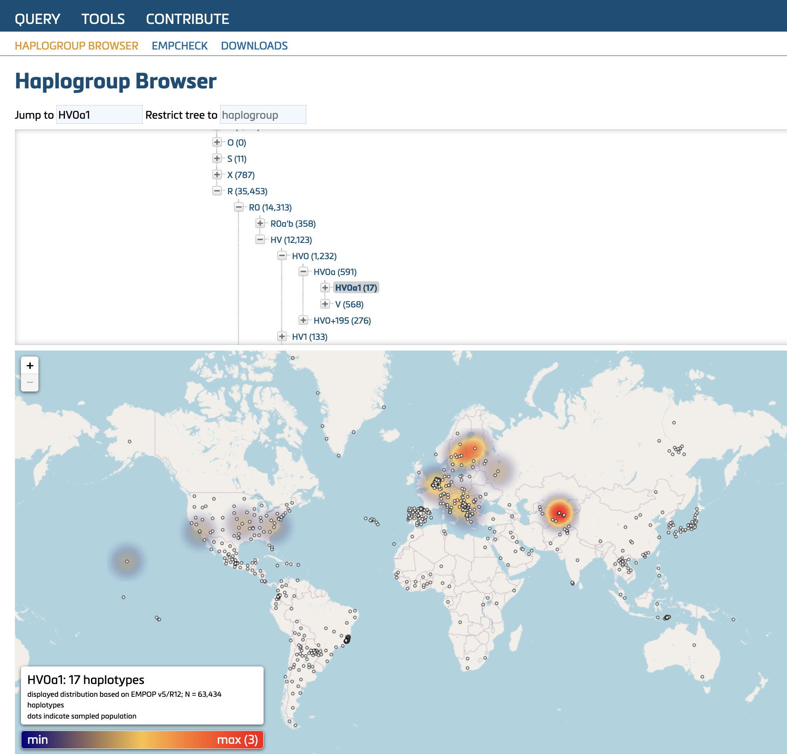
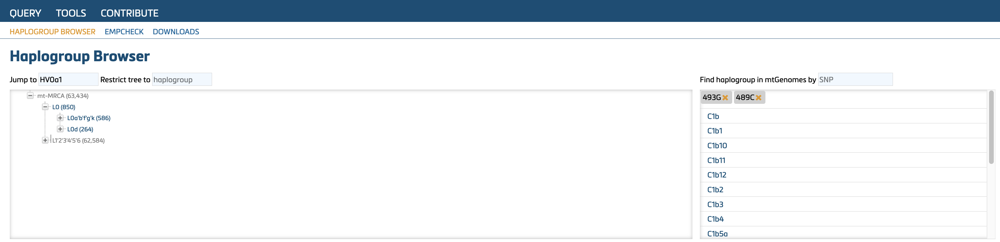
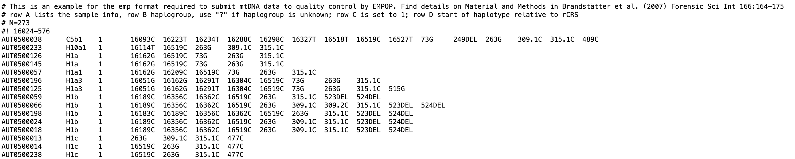

## 6. EMPOP Tools

The **EMPOP tools** tab includes software to support the analysis and interpretation of mtDNA sequence variation.

### 6.1.	Haplogroup Browser
Haplogropup Browser consists of two parts, **haplogropup distribution** and **variant finder**. 

#### 6.1.1.	Distribution of haplogroups
This tool provides a searchable format of the most recent Phylotree (b.17) haplogroups. Key features include:

- Assignment of quality-controled EMPOP sequences to haplogroups using the most common recent ancestor (MRCA, numbers in brackets)
- Graphical display (heatmap) of haplogroup distribiution

Details can be found in [Dür et al. 2021](https://doi.org/10.3390/ijms22115747).

This feature can be used to evaluate the distribution of mtDNA haplogroups around the globe.

Distributin of haplogroup HV0a1. Nodes represent sampled regions.

#### 6.1.2.	Variant finder
This tool allows the search for specific variant(s) in vetted mitogenomes from GenBank and displays the corresponding haplogroup(s) containing the variant(s). The figure below illustrates the search results for 493G and 489C. Click on any resulting haplogroup to view its distribution on the map.

### 6.2.	EMPcheck
EMPcheck is a tool to perform plausibility checks on rCRS-coded data.
The file format must meet the requirements described below (see [Parson et al., 2014](http://dx.doi.org/10.1016/j.fsigen.2014.07.010)).

Example of an [valid EMP-file](https://raw.githubusercontent.com/gmitirol/empophub/master/AUT273_spec.emp) from EMPOP: 

The EMP-file is a tab-delimited text file.

- Lines beginning with "#" are ignored by the software and are intended solely for documentation purposes.
- Lines beginning with "#!" specify the sequence range(s) for the mitotype(s) listed below that line. The defined sequence range applies to all mitotypes that follow until a new "#!" range is specified. Thus, multiple mitotypes with different sequence ranges can be handled in one file.

The EMP-file uses columns with the following contents:

- Column A: Sample ID: **do not** use blank space or special characters (allowed characters include letters (excluding ä, ö, ü), numbers, "-", "_", "/")
- Column B: indicate haplogroup or use "?" if unknown
- Column C: Frequency of mitotype (0 - 9999). Typically, this value is set to “1”, as individual mitotypes should be presented. If this value is set to 0 the sample is excluded from analysis by the EMPOP software. Alternatively, a "#" can be added at the beginning of the line to exclude a mitotype from analysis.
- Column D: Annotation of the variants relative to the rCRS. Variants need to be separated by tabs-delimiters (or place each variant in individual cells if using MS Excel). Follow the forensic notation guideline as detailed in the revised and updated ISFG recommendations for mtDNA typing ([Parson et al, 2014](http://dx.doi.org/10.1016/j.fsigen.2014.07.010)) and in this document (Chapter 4).

**EMPCheck** provides feedback on the data structure and variant nomenclature. Any violations are highlighted in $${\color{red}red}$$ and must be corrected before proceeding with further actions (e.g., contributing an mtDNA dataset for EMPOP Quality Control).
