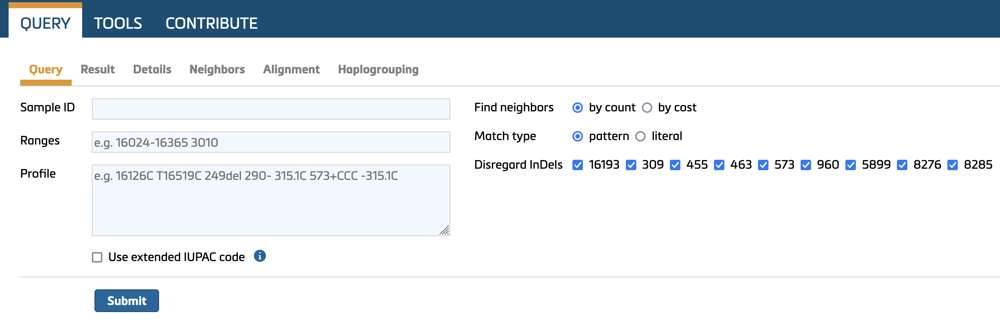
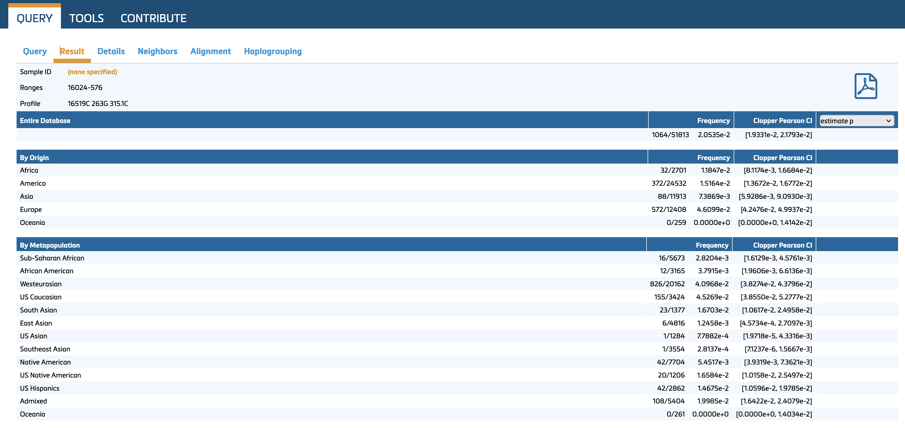
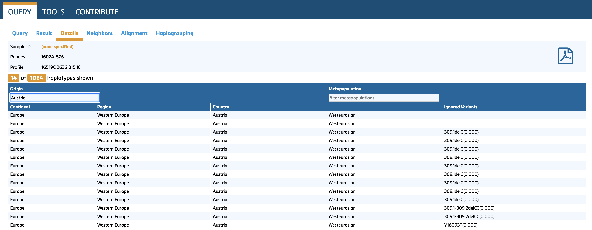
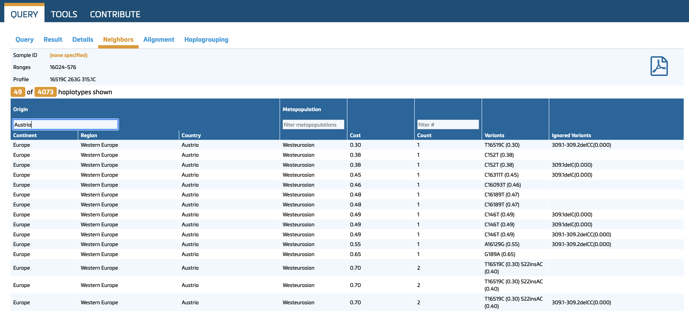

## 4. Using EMPOP for mitotype searches

EMPOP adheres to the revised and extended guidelines for mitochondrial DNA typing as issued by the DNA Commission of the ISFG [Parson et al., 2014](http://dx.doi.org/10.1016/j.fsigen.2014.07.010). For further details, please refer to the referenced document.

**EMPOP’s Query Engine - SAM 2**

EMPOP employs SAM 2, an updated and optimized software developed through rigorous testing with carefully curated full mitogenome sequences. This software performs unbiased and conservative database queries to support the statistical evaluation of evidence in forensic practice. Key improvements over the earlier version of SAM [Röck et al, 2011](https://doi.org/10.1016/j.fsigen.2010.10.006) include:

1. updated alignment/nomenclature conventions for the phylogenetically instable regions 50-70, 310-316, 455-460, 961-966, 8276-8279, 16180-16193, and 16258-16262
2. *count* and *cost* search modes for neighbours
3. implementation of 28 block indels containing between 2 and 264 base-pairs

|     No.    |     Insertion position    |     Deletion positions    |     Pattern            |     Length [in bp]    |
|------------|---------------------------|---------------------------|------------------------|-----------------------|
|     1      |     16032                 |     16032.1-16032.15      |     TCTCTGTTCTTTCAT    |     15                |
|     2      |     16164                 |     16165-16318           |     AACCCAATCCACA…     |     154               |
|     3      |     16309                 |     16310-16316           |     GTACATA            |     7                 |
|     4      |     104                   |     105-110               |     CGGAGC             |     6                 |
|     5      |     105                   |     106-111               |     GGAGCA             |     6                 |
|     6      |     209                   |     209.1-209.7           |     GTGTGTT            |     7                 |
|     7      |     241                   |     241.1-241.3           |     TAA                |     3                 |
|     8      |     286                   |     286.1-286.5           |     TAACA              |     5                 |
|     9      |     290                   |     291-294               |     ATTT               |     4                 |
|     10     |     291                   |     291.1-291.16          |     ACATCATAACAAA…     |     16                |
|     11     |     292                   |     292.1-292.2           |     AT                 |     2                 |
|     12     |     292                   |     292.2-292.4           |     AT                 |     2                 |
|     13     |     306                   |     307-356               |     CCCTCCCCCCGCT…     |     51                |
|     14     |     309                   |     310-315               |     TCCCCC             |     6                 |
|     15     |     315                   |     316-319.0             |     GCTT               |     4                 |
|     16     |     342                   |     342.1-342.2           |     AT                 |     2                 |
|     17     |     343                   |     343.1-343.3           |     ATC                |     3                 |
|     18     |     368                   |     368.1-368.4           |     AGAA               |     4                 |
|     19     |     398                   |     398.1-398.14          |     ACCAGATTTCAAAT     |     14                |
|     20     |     470                   |     471-478               |     TACTACTA           |     8                 |
|     21     |     494                   |     494-503               |     CCCCGCCCA          |     9                 |
|     22     |     524                   |     524.1-524.2           |     GC                 |     2                 |
|     23     |     563                   |     563.1-563.204         |     AACAAAGAACCC...    |     204               |
|     24     |     588                   |     568.1-588.16          |     CACAGTTTATGTA…     |     16                |
|     25     |     3326                  |     3327-3590             |     ACTCCTCATTGTA…     |     264               |
|     26     |     6019                  |     6020-6024             |     CGAGC              |     5                 |
|     27     |     9486                  |     9487-9501             |     TCGCAGGATTTTT…     |     15                |
|     28     |     14786                 |     14787-14790           |     TTAA               |     4                 |
|     29     |     16006                 |     16006.1-16006.3       |     CTA                |     3                 |

### 4.1 Query Options

#### 4.1.1. Sample ID
Use this field to enter the ID of a mitotype. The search results will be linked to this ID and included in any printouts. Sample IDs also serve to track and identify user queries in the search history, ensuring efficient and personalized access to information.

#### 4.1.2. Ranges	
Database queries require the specification of interpretation ranges for rCRS-coded and FASTA-like string mitotypes. Commonly used ranges include HVS-I (16024–16365), HVS-II (73–340), CR (16024–576), and the entire mitogenome **(ALL)**. Individual SNPs can also be queried by specifying the SNP in the range field (e.g., 3010). 

It is important to note that EMPOP relies on the sequence range provided by the submitting laboratory. As a result, these ranges may vary slightly across different submissions or populations. 

Note that the omission of sequence information within a specified range will be interpreted as rCRS-based data. This can result in artificial recombination, potentially impacting the accuracy of analyses. Further details, see in e.g., [Bandelt et al, 2004](https://doi.org/10.1007/s00414-004-0455-2).

#### 4.1.3. Mitotype
- **Format Options**: Query your mitotype either as FASTA-like sequence string or reported relative to the [revised Cambridge Reference Sequence (rCRS)](https://doi.org/10.1038/13779).

- **FASTA-like string**: 
  - Provide the nucleotide sequence only. Do **not** include header information typically used in standard FASTA formats.
  - Copy and paste the sequence string directly from a text file or use the consensus sequence generated by your analysis software.
 
    

- **rCRS coded mitotypes**:  
  - Use the **extended** IUPAC nucleotide code to input your mitotype. Refer to the table below for the list of acceptable formats.
 
  - **IMPORTANT:**
    
    ❗ EMPOP uses lowercase letters to denote the presence of both a deletion and a nucleotide at a specific position. For example, 152c indicates a mixture of 152C and 152del. For additional details, refer to the revised [ISFG guidelines](http://dx.doi.org/10.1016/j.fsigen.2014.07.010).
    
    ❗ **Do not** use "d" to describe deletions, as "d" represents a mixture of A, G, T and a deletion according to the extended IUPAC nucleotide code. For **deletions** use "del" or "-".

|     Type            |     Possible annotations                                             |     Comment                                                                                                                                                                                                                                                                                              |
|---------------------|----------------------------------------------------------------------|----------------------------------------------------------------------------------------------------------------------------------------------------------------------------------------------------------------------------------------------------------------------------------------------------------|
|     Base changes    |     73G, A73G                                                        |     If preceding bases are included, they must match the rCRS base at the specified position.                                                                                                                                                                                                                        |
|     Insertions      |     315.1C     -315.1C     315+C     309.1C     309.2C     309+CC    |     For multiple insertions all preceding insertions need to be stated, e.g., annotating 309.2C is not possible without 309.1C                                                                                                                                                               |
|     Deletions       |     249-     A249-     249delA     249del                            |     'del' is treated case insensitive, e.g. Del, DEL, dEL, deL etc is   accepted. Note that the single character 'D' is considered a mixture of A, G, and T (IUPAC).

#### 4.1.4. Find neighbors
EMPOP provides two methods for searching neighbors: by **count** and by **cost**. Under the current settings, EMPOP identifies neighbors with:
- A **count** difference of up to **2**.
- A **cost** threshold of **5.34** (find details on cost estimation in [Huber et al, 2018](https://10.1016/j.fsigen.2018.09.001).

The default setting for forensic frequency estimates is **neighbor search by count**.

#### 4.1.5. Match type
Match type settings are relevant for the mode of querying **point heteroplasmy**.

- **Pattern Match:** Mixture designations match all their individual components.
  Example: Y = {C, T, Y}
  A query of 152Y matches both T152 and 152C

- **Literal Match:** Mixture designations are treated as exclusive, matching only their specific designation.
  Example: Y = {Y}
  A query of 152Y matches only 152Y

The default setting for forensic frequency estimates is **pattern match**.

#### 4.1.6. Disregard InDels 
These settings are relevant for the mode of querying **length heteroplasmy**.

Length heteroplasmy is located in known hotspots (homopolymeric tracts) for insertions and deletions (indels). They should be excluded from standard forensic database queries. These include:

- **Control Region:**
  C-runs near positions 16193, 309, 463, and 573
  The T-run near position 455

  ❗ Note: The C-insertion downstream of nucleotide position 315, i.e., 315.1C, 315+C, is not a length heteroplasmic variant but a phylogenetically stable insertion relative to the rCRS.

- **Coding Region:**
  Length variants near positions 960, 5899, 8276, and 8285
  

|     Length variant    |     5’ junction    |     3’ junction    |     Repeating motif    |
|-----------------------|--------------------|--------------------|------------------------|
|     16193             |     16189          |     16194          |     C                  |
|     309               |     302            |     316            |     C                  |
|     315*              |     302            |     316            |     C                  |
|     455               |     451            |     456            |     T                  |
|     463               |     460            |     464            |     C                  |
|     573               |     567            |     574            |     C                  |
|     960               |     955            |     961            |     C                  |
|     5899              |     5894           |     5900           |     C                  |
|     8276              |     8271           |     8277           |     C                  |
|     8285              |     8280           |     8286           |     C                  |

❗ Note that the C-insertion between 310 and 316 is a stable length variant, not a length hotspot. It is listed here for uninterrupted C-runs as a consequence of T310C.

**Standard query settings** disregard discrepancies in hotspot length variant regions between query and database sequences.

### 4.2. Result
The execution of a database query automatically directs the user to the Results tab. Sample ID, query range(s) and mitotype are indicated in the header. The following information is listed in the results table:
 
- total number of observed matches in the entire database
- number of observed matches sorted by geographic origin
- number of observed matches by metapopulation affiliation

An uncorrected frequency estimate is provided including a two-tailed Clopper Pearson confidence interval. Probabilities can be estimated using the following options (drop-down box):
- (x+1)/(n+1)
- (x+2)/(n+2)
- CI from zero pop

Where x… number of matches and n… database size.

**Range-Dependent Inclusion of Mitotypes in Query Results:**
The number of mitotypes included in a query result depends on the **specified sequence range(s)**. Only database mitotypes whose sequence range(s) overlap with the query range will be considered.

- **Example:** A query with the range **16024–576** includes all database sequences typed for the entire **control region**. However, **HVS-I/II** data (e.g., 16024–16365 and 73–340) would not be included in such a query. To ensure **comprehensive results**, it may be prudent to perform an additional query using standard HVS-I/II sequence ranges (e.g., 16024–16365 and 73–340).

❗ **Note:**
The numbers of matches listed under **Origin** represent the total number of matches in the database.
The numbers of matches under **Metapopulation** may exceed the total database matches because some metapopulations are **subsets** of others.
For example, **US Caucasian** is a sub-metapopulation of **Westeurasian**.

### 4.3. Details
The **Details** tab summarizes the matches from **Result** and provides country of sampling and metapopulation (filters can be applied for geographic origin and metapopulation). Ignored variants (costs = 0) are listed; details can be found in [Huber et al. (2018)](https://pubmed.ncbi.nlm.nih.gov/30241075/).

When **no matches** are found the **Details** tab stays empty.

### 4.4. Neighbors
Displays database mitotypes that differ from the query mitotype by:
- Up to **two** differences (count) or
- Costs of up to **5.34** (find details on cost estimation in [Huber et al, 2018](https://10.1016/j.fsigen.2018.09.001)).
  

The neighbors' display follows the same principles as the summary of matches (refer to 4.3. Details). Differences between query and database mitotypes are treated as (biological) **events**.

- Definition of an **Event**:
    An **event** reflects the biological significance of a difference, rather than the absolute number of differing nucleotides.

- **Examples**:
-   A tandem deletion (or insertion) in the AC-repeat region between positions 514–524 is considered one event, representing a single difference between otherwise matching mitotypes, i.e., 523del 524del, 524.1A 524.2C, etc ...
-   The 6 bp "Chibcha" deletion between positions 105–110 or 106–111 is considered on event.
-   The 9 bp deletion between positions 8281–8290 is considered on event.

Additional Information:
- Differences between the query mitotype and its neighbors are detailed in the following columns:
- Cost: Reflecting the calculated genetic distance.
- Count: Indicating the total number of differences (events).
- (missing) variants: Specifying the exact nucleotide differences.

Costs are estimated by the change from the database mitotype symbol to the query mitotype symbol (approx. 1.0 for an average transition; ee [Huber et al, 2018](https://pubmed.ncbi.nlm.nih.gov/30241075/) for further details).

### 4.5. Alignment
The phylogenetic alignment ([Bandelt and Parson, 2007](https://doi.org/10.1007/s00414-006-0151-5)) is contrasted to the query input of the mitotype. Discrepancies are highlighted in red color.

### 4.6. Haplogrouping
Haplogrouping introduces a new algorithm specifically developed for the alignment and the haplogroup estimation of human mtDNA sequences. The original 5435 haplogroup motifs (Phylotree Build 17) were refined without altering haplogroup nomenclature. We adapted 430 motifs (8%) and added 966 motifs for new subclades, resulting in an 18% increase in haplogroup defining motifs for full mitogenomes and a 30% increase for the mtDNA control region.

For details see [Dür et al, 2021](https://doi.org/10.3390/ijms22115747).

