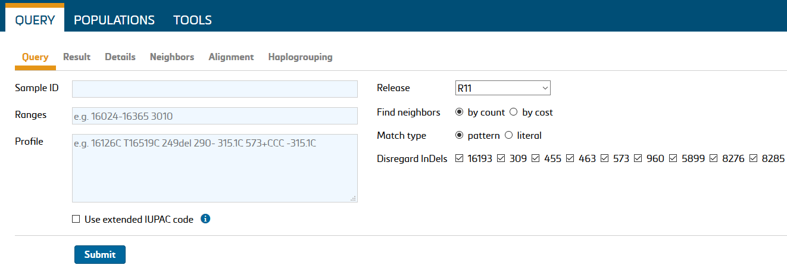
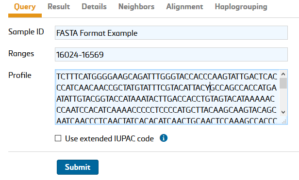
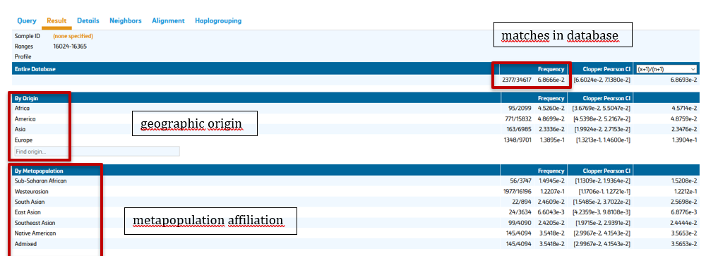
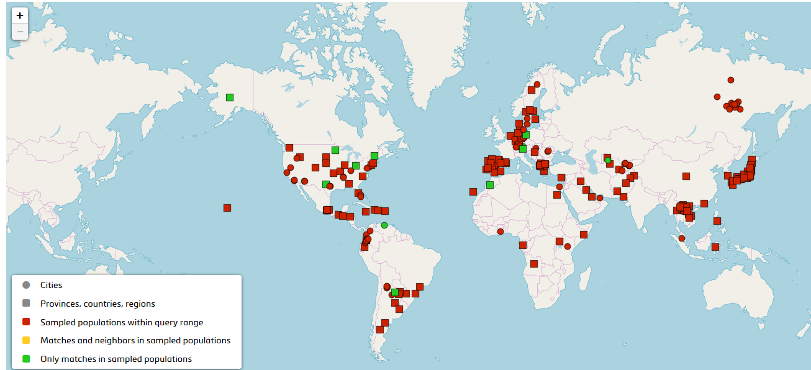
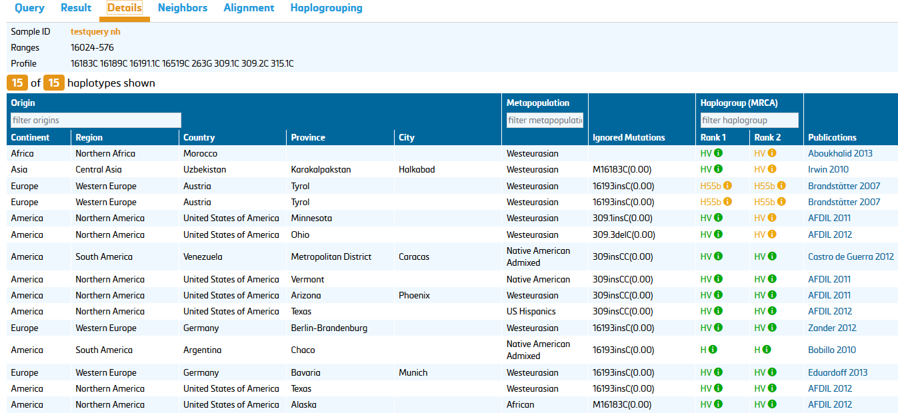
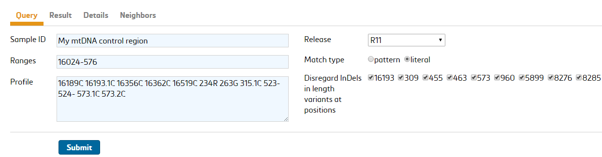
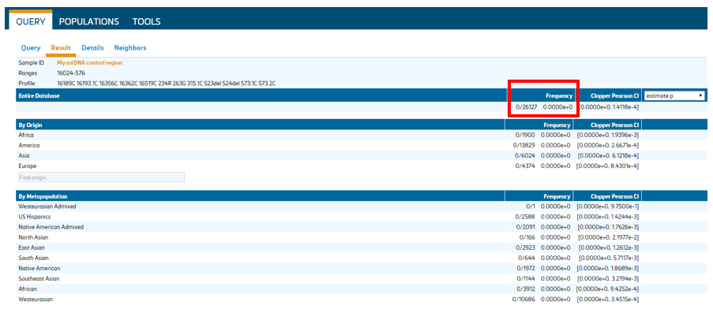
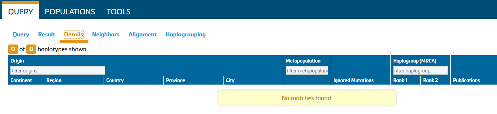
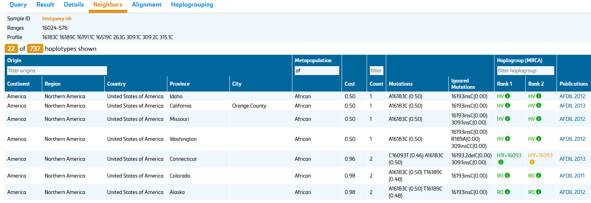
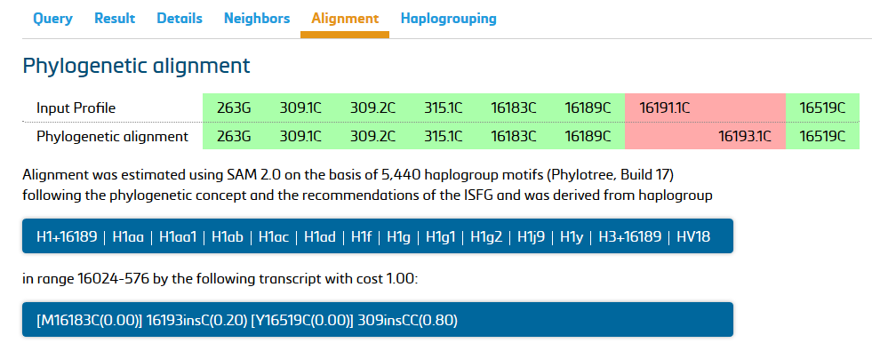

## 4. Using EMPOP for mitotype searches

EMPOP follows the revised and extended guidelines for mitochondrial DNA typing issued by the DNA commission of the ISFG (Parson et al. 2014). See document for further details.

**EMPOP’s query engine - SAM 2**

EMPOP uses SAM 2, an updated and optimized software based on tests with carefully curated full mitogenome sequences to perform unbiased and conservative database queries to assist statistical evaluation of the evidence in forensic practice.
The major changes to the earlier version of the software SAM (Röck et al 2011) include:

1. updated alignment/nomenclature conventions for the phylogenetically instable regions 50-70, 310-316, 455-460, 961-966, 8276-8279, 16180-16193, and 16258-16262
2. *count* and *cost* search modes for neighbours
3. implementation of 28 block indels containing between 2 and 264 base-pairs

|     No.    |     Insertion position    |     Deletion positions    |     Pattern            |     Length [in bp]    |
|------------|---------------------------|---------------------------|------------------------|-----------------------|
|     1      |     16032                 |     16032.1-16032.15      |     TCTCTGTTCTTTCAT    |     15                |
|     2      |     16164                 |     16165-16318           |     AACCCAATCCACA…     |     154               |
|     3      |     16309                 |     16310-16316           |     GTACATA            |     7                 |
|     4      |     104                   |     105-110               |     CGGAGC             |     6                 |
|     5      |     105                   |     106-111               |     GGAGCA             |     6                 |
|     6      |     209                   |     209.1-209.7           |     GTGTGTT            |     7                 |
|     7      |     241                   |     241.1-241.3           |     TAA                |     3                 |
|     8      |     286                   |     286.1-286.5           |     TAACA              |     5                 |
|     9      |     290                   |     291-294               |     ATTT               |     4                 |
|     10     |     291                   |     291.1-291.16          |     ACATCATAACAAA…     |     16                |
|     11     |     292                   |     292.1-292.2           |     AT                 |     2                 |
|     12     |     292                   |     292.2-292.4           |     AT                 |     2                 |
|     13     |     306                   |     307-356               |     CCCTCCCCCCGCT…     |     51                |
|     14     |     309                   |     310-315               |     TCCCCC             |     6                 |
|     15     |     315                   |     316-319.0             |     GCTT               |     4                 |
|     16     |     342                   |     342.1-342.2           |     AT                 |     2                 |
|     17     |     343                   |     343.1-343.3           |     ATC                |     3                 |
|     18     |     368                   |     368.1-368.4           |     AGAA               |     4                 |
|     19     |     398                   |     398.1-398.14          |     ACCAGATTTCAAAT     |     14                |
|     20     |     470                   |     471-478               |     TACTACTA           |     8                 |
|     21     |     494                   |     494-503               |     CCCCGCCCA          |     9                 |
|     22     |     524                   |     524.1-524.2           |     GC                 |     2                 |
|     23     |     563                   |     563.1-563.204         |     AACAAAGAACCC...    |     204               |
|     24     |     588                   |     568.1-588.16          |     CACAGTTTATGTA…     |     16                |
|     25     |     3326                  |     3327-3590             |     ACTCCTCATTGTA…     |     264               |
|     26     |     6019                  |     6020-6024             |     CGAGC              |     5                 |
|     27     |     9486                  |     9487-9501             |     TCGCAGGATTTTT…     |     15                |
|     28     |     14786                 |     14787-14790           |     TTAA               |     4                 |
|     29     |     16006                 |     16006.1-16006.3       |     CTA                |     3                 |

### 4.1 Query Options

#### 4.1.1. Sample ID
Use this field to enter the ID of a mitotype. Search results are linked to this information and also provided on printouts. Sample IDs are used to identify queries in the search history of each individual user.

#### 4.1.2. Ranges	
Database queries require specification of the interpretation range(s) for rCRS-coded and FASTA-like string mitotypes. Typical ranges are: HVS-I (16024-16365), HVS-II (73-340), CR (16024-576), mitogenome (ALL).
Individual SNPs can be queried by indicating the SNP in the range field, e.g. 3010. Note that EMPOP depends on the sequence range provided by the submitting laboratory, which is why the ranges can be slightly different for some submissions/populations.

#### 4.1.3. Mitotype
Submit your mitotypes as FASTA-like sequence strings or reported relative to the rCRS. 
Query sequence strings:
Copy&paste the sequence string from a text file or a consensus from sequence analysis software. Do not enter header information like in usual FASTA format; enter nucleotides only. For mixtures (e.g point heteroplasmy) use the extended IUPAC code (see below).

*Query rCRS aligned mitotypes:*
Differences to the revised Cambridge Reference Sequence (rCRS, Andrews et al 1999) are entered as mitotypes.

|     Type            |     Possible annotations                                             |     Comment                                                                                                                                                                                                                                                                                              |
|---------------------|----------------------------------------------------------------------|----------------------------------------------------------------------------------------------------------------------------------------------------------------------------------------------------------------------------------------------------------------------------------------------------------|
|     Base changes    |     73G, A73G                                                        |     If preceding bases are used they must match rCRS base at the given   position                                                                                                                                                                                                                        |
|     Insertions      |     315.1C     -315.1C     315+C     309.1C     309.2C     309+CC    |     For multiple insertions all preceding insertions need to be stated,   i.e. annotating 309.2C is not possible without annotating 309.1C                                                                                                                                                               |
|     Deletions       |     249-     A249-     249delA     249del                            |     'del' is treated case insensitive, e.g. Del, DEL, dEL, deL etc is   accepted.     Please note that the single character 'D' is considered a mixture of   A, G, and T (IUB code). The single character 'd' is considered a mixture of   A, G, T, and deletion (see Parson et al 2014 for details).    |

⚠️ Note that the EMPOP query discerns capital letters (A,G, C, T, Y, …) from uncapitalized letters (a, g, c, t, y, …).
⚠️ Uncapizalized letters stand for a mixture of a deletion and a non-deleted variant. E.g. T152c represents two variants, T152C and T152del. 

#### 4.1.4. Release
EMPOP 4 offers release-specific queries. The most recent database release is selected by default. Earlier database releases can be selected if available. 

#### 4.1.5. Find neighbors
EMPOP offers searching for neighbors by count and by cost. Under current settings EMPOP reports neighbors within a count of 2 differences or costs of 5.34 see ([Huber et al 2018](https:// 10.1016/j.fsigen.2018.09.001)).
Finding neighbors by count is the default setting for forensic frequency estimates.

#### 4.1.6. Match type
This is relevant for the consideration of point heteroplasmy in both the query sequence as well as the database sequences.
*Pattern match:* mixture designations match its individual components (Y={C,T,Y}). Example: 152Y matches 152T and 152C.
*Literal match:* mixture designations are considered exclusive to all other nucleotide designations (Y={Y}). Example: 152Y matches only 152Y.
Pattern match is the default setting for forensic frequency estimates.

#### 4.1.7. Disregard InDels 
Length variants that are known hotspots for insertion/deletions (indels) should be ignored in a forensic database query. This involves the C-runs around positions 16193, 309, 463 and 573 and the T-run around position 455 relative to the rCRS in the control region. In the coding region length variants around positions 960, 5899, 8276 and 8285 are ignored for a forensic query.

|     Length variant    |     5’ junction    |     3’ junction    |     Repeating motif    |
|-----------------------|--------------------|--------------------|------------------------|
|     16193             |     16189          |     16194          |     C                  |
|     309               |     302            |     316            |     C                  |
|     315*              |     302            |     316            |     C                  |
|     455               |     451            |     456            |     T                  |
|     463               |     460            |     464            |     C                  |
|     573               |     567            |     574            |     C                  |
|     960               |     955            |     961            |     C                  |
|     5899              |     5894           |     5900           |     C                  |
|     8276              |     8271           |     8277           |     C                  |
|     8285              |     8280           |     8286           |     C                  |

❗ Note that the C-insertion between 310 and 316 is a stable length variant, not a length hotspot. It is listed here for uninterrupted C-runs as a consequence of T310C.

Standard query settings disregard discrepancies in hotspot length variant regions between query and database sequences.
Note that costs of disregarded InDels do not contribute to the final costs, which influences the ranking of results. See section 4.4. Neighbors.

### 4.2. Result
The execution of a database query automatically directs the user to the Results tab. Sample ID, query range(s) and mitotype are indicated in the top lines. Following information is listed in the results table:
 
1.	number of observed matches in the entire database
2.	number of observed matches sorted by geographic origin and
3.	number of observed matches by metapopulation affiliation

An uncorrected frequency estimate is provided including a two-tailed Clopper Pearson confidence interval. Correction for sampling bias is provided and alternative methods to calculate probabilities are provided in the drop-down box to the right. P values can be estimated based on following formulas:

1.	(x+1)/(n+1)
2.	(x+2)/(n+2)
3.	CI from zero pop

Where x… number of database hits and n… database size

Free text searches are possible for origin and metapopulation to address the relevant subset of the database. This depends on the formulation of the hypothesis, e.g. the reduction of the dataset to the country of Spain.

Note that the number of mitotypes included in a query result depends on the indicated sequence range. Only mitotypes with overlapping sequence ranges to the query sequence are considered. E.g. the query range 16024-576 includes all database sequences that were typed for the entire control region. HVS-I/II data (16024-16365 73-340) are not included in such a query. It may therefore be conservative to also perform a query with standard HVS-I/II sequence ranges.

Below the tabular representation of the database query an interactive map can be found that depicts the sampled populations within the query range (red) and the matches in the sampled populations (green).

### 4.3. Details
The Details tab provides a more detailed presentation of the matching mitotypes.

#### 4.3.1. When matches are found

EMPOP provides a summary table of all matching mitotypes that meet the queried sequence range. Columns can be sorted by clicking on the column headers.
Geographic and metapopulation origins can be filtered using the text boxes.
Ignored mutations list the differences between database and query sequences that were disregarded for the search (see 4.1.7. Disregard InDels ). The values in brackets display the costs of the listed mutation (details see Huber et al 2018).
Haplogroup indicates the samples’ haplogroup assignment. In case of a database match, there is no need to estimate the haplogroup as this column simply indicates the haplogroup of the matching samples. Rank 1 displays the haplogroup estimate with lowest costs (including a tolerance of 0.1) and Rank 2 displays the haplogroup estimate with the next lowest costs (including a tolerance of 0.1).

4.3.2. When no matches are found
MtDNA sequence queries often do not result in database matches. In these cases the Details tab stays empty.

Unobserved mitotypes are indicated by a frequency value of “0”:

In Details no matches are listed:

### 4.4. Neighbors
Similar sequences with a low number of differences are displayed here.

The display of neighbors follows the same concept as the summary of matches (see 4.3. Details) and includes all mitotypes that are at a distance to the query sequence of one and two differences (“events”).
An “Event” refers to the biological meaning of any difference but not the absolute number of differing nucleotides. As such, a tandem deletion (or insertion) in the AC-repeat region between 514 and 524 is regarded as one event, and therefore one difference between otherwise matching mitotypes. The same rationale applies to the 6 bp Chibcha deletion between 105 and 110 or 106 and 111, the 9 bp deletion between 8281 and 8290, as well as other (less abundant) block indels in the mitochondrial genome.
Additional information is provided with regard to differences between query mitotype and neighbors. These are listed in the columns cost, count and mutations.

Costs are determined by the change from the base profile symbol to the test profile symbol (approximately 1.0 for an average mutation). See Huber et al 2018 for further details.

Count lists the number of mutational events between query and database mitotypes.
Note that some combined mutations are single events, e.g. 523del 524del or 106-111del and treated as such in EMPOP.

Mutations specifies differences between query and database mitotypes, which are listed with the individual costs. Disregarded indels do not contribute to the final costs.

### 4.5. Alignment
Since EMPOP 4 the phylogenetic alignment is displayed as illustrated in Figure 10 below:

### 4.6. Haplogrouping
The assignment of haplogroups to mitotypes contributes substantial value for quality control, not only in forensic genetics but also in population and medical genetics. The availability of Phylotree, a widely accepted phylogenetic tree of human mitochondrial DNA lineages, led to the development of several (semi-)automated software solutions for haplogrouping. However, the currently existing tools only make use of haplogroup-defining mutations, whereas private mutations (beyond the haplogroup level) can be additionally informative allowing for enhanced haplogroup assignment.

The scientific publication is currently under preparation, details will follow later. 

